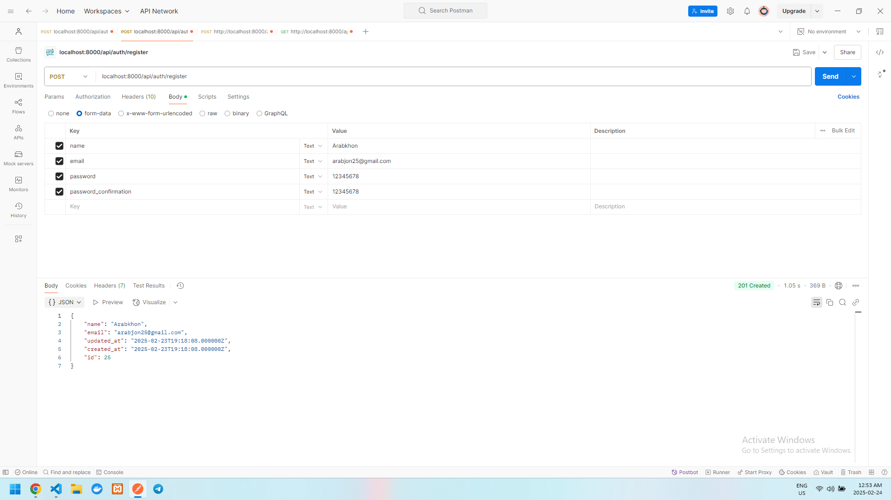
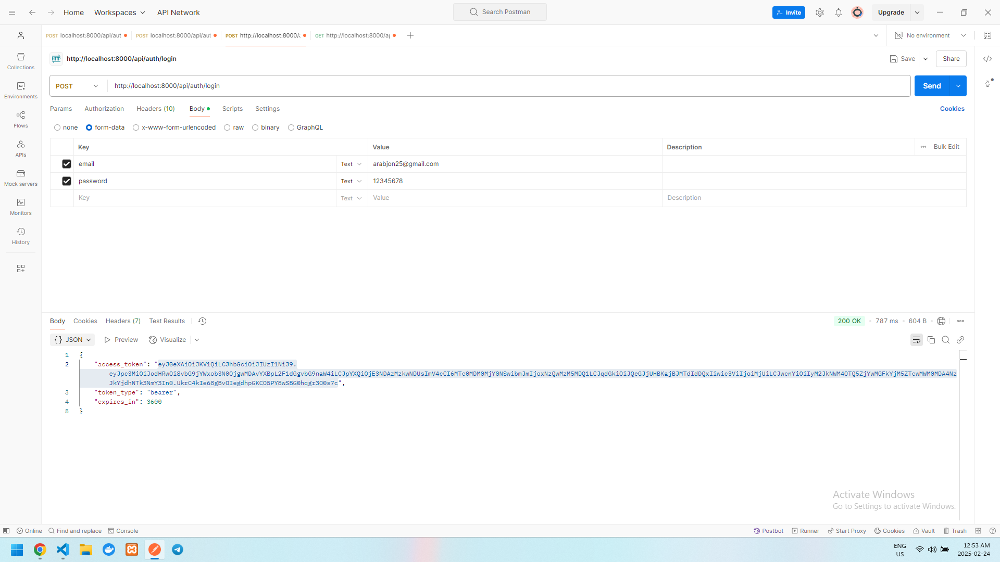
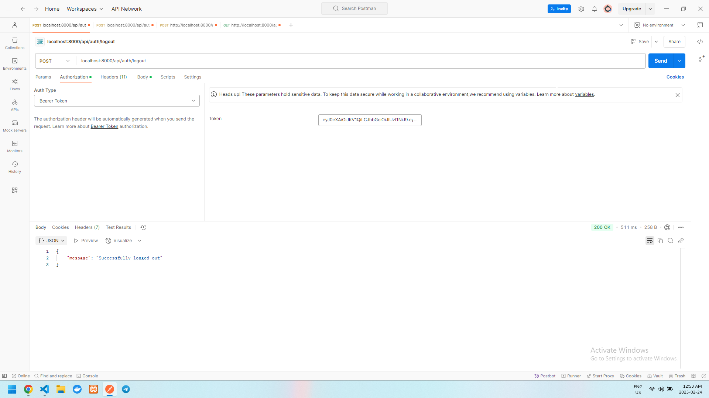
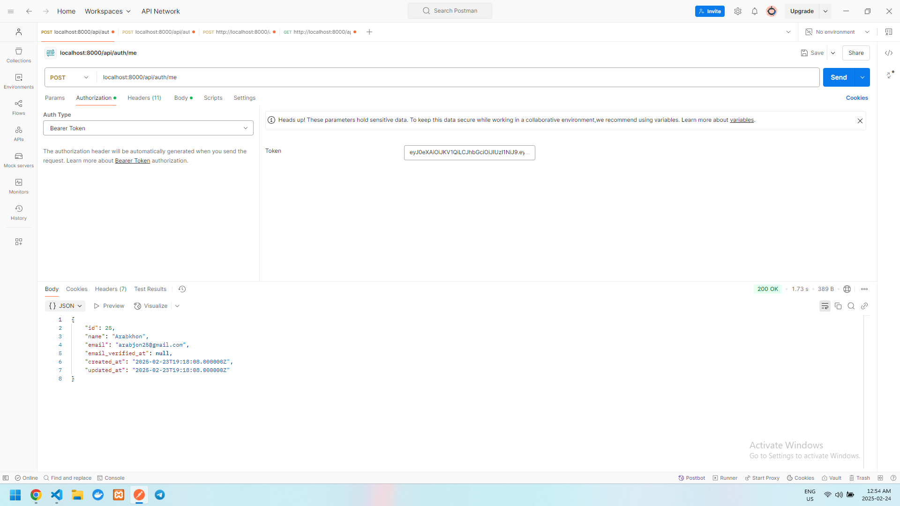
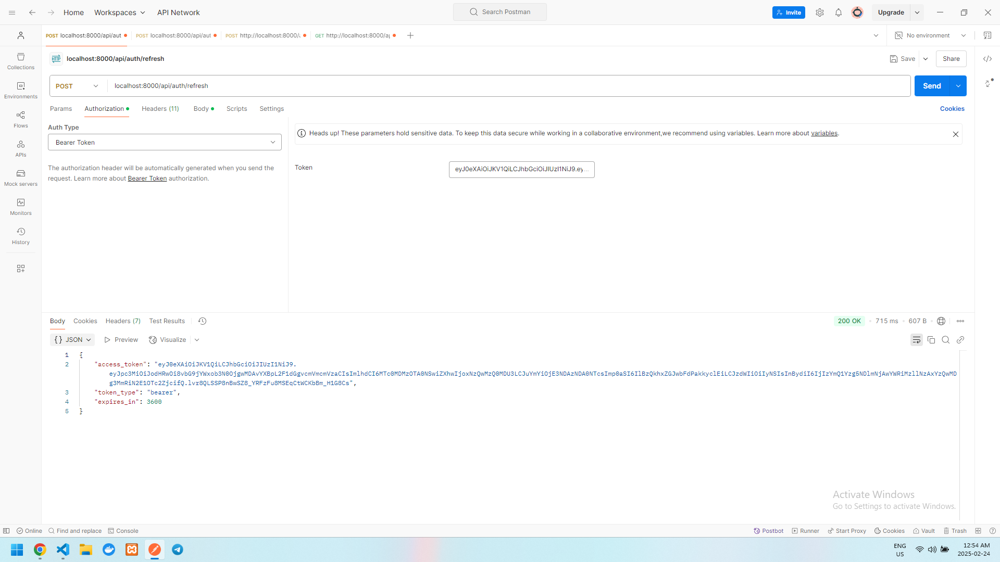

# Bu project task uchun berilgan.
## Projectni o'zingizni local kompyuterizda ishga tushirish uchun bajariladigan ishlar ketma ketligi
### 1 
```
git clone https://github.com/ArabkhonDev/task-tg
```

### 2
```
composer install
npm install && npm run build
```
### 3
~~~
.env file yaratib .env.example ga qarab sozlab olish
~~~

### 4
```
php artisan key:generate
php artisan migrate
```
### 5
Agar tayyor Admin va Client users ni run qilmoqchi bo'lsangiz
```
php artisan db:seed --force
```

### 6
Admin
```
login: manager@gmail.com
parol: secret123
```
```
Admin Category va Product ni Crud qila iladi
```

Client bo'lib login qilish

```
login: client@gmail.com
parol: secret123
```
```
Client userlar Category va Product listlarni ko'ra oladi va xar biri 
ichiga kirib ko'rishi xam mumkin, lekin yaratish va o'zgartirish 
uchun xuquqi mavjud emas 
```
### JWT-Auth
```
http:localhost:8000/api/auth/register
```


```
http:localhost:8000/api/auth/login
```


```
http:localhost:8000/api/auth/logout
```


```
http:localhost:8000/api/auth/me
```


```
http:localhost:8000/api/auth/refresh
```



### Docker Compose, Elasticsearch

```
bular tugallanmadi
```
